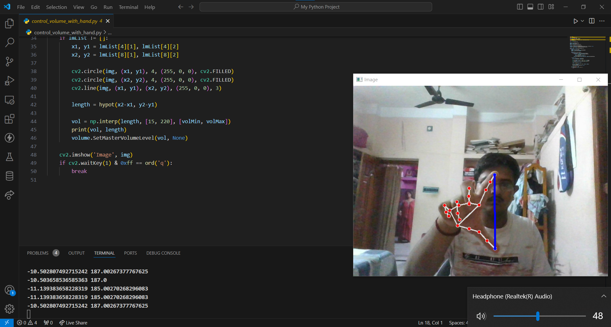

# 1. Hand Gesture Volume Control



This project uses hand gestures to control the system volume in real time. The system leverages computer vision to detect hand landmarks and adjusts the volume based on the distance between specific fingertips.

## Features

- **Real-Time Volume Control**: Adjusts system volume based on hand gestures detected via the webcam.
- **Hand Tracking**: Uses MediaPipe to track hand landmarks, specifically the fingertips.
- **Volume Adjustment**: Implements Pycaw to interface with the system's audio controls.

## Technologies Used

- **Python**: Core programming language.
- **OpenCV**: Used for image capture and processing.
- **MediaPipe**: Provides real-time hand-tracking for gesture recognition.
- **Pycaw**: Enables system volume control.

## How It Works

1. **Hand Detection**: Captures video from the webcam and detects hand landmarks using MediaPipe.
2. **Gesture Recognition**: Calculates the distance between the thumb and index finger to interpret as a volume level.
3. **Volume Adjustment**: Maps the fingertip distance to system volume range and adjusts volume accordingly.

## Installation

1. Clone the repository:
    ```bash
    git clone https://github.com/supratim1020/single_file_project/blob/d27724276e34d721e25fa00708cab56dec5b0252/control_volume_with_hand.py
    cd hand-gesture-volume-control
    ```

2. Install the required packages:
    ```bash
    pip install opencv-python mediapipe comtypes pycaw
    ```

## Usage

Run the script to start the volume control system:
```bash
python hand_volume_control.py
